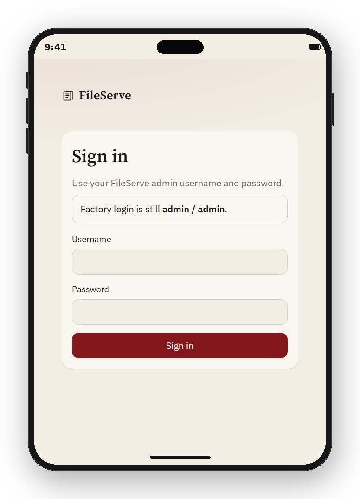
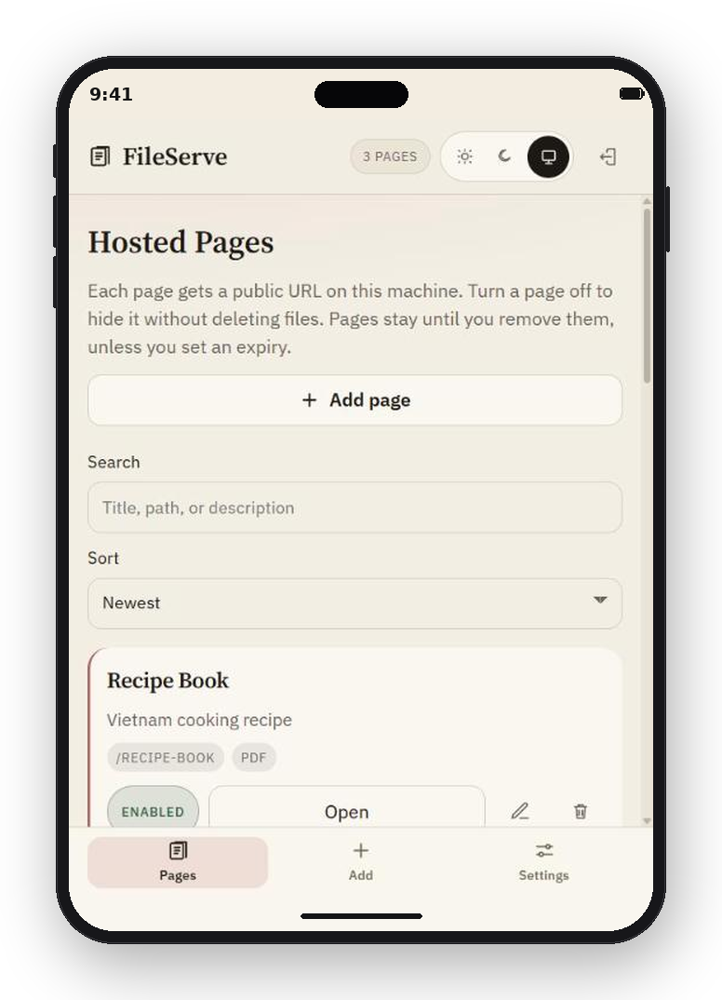
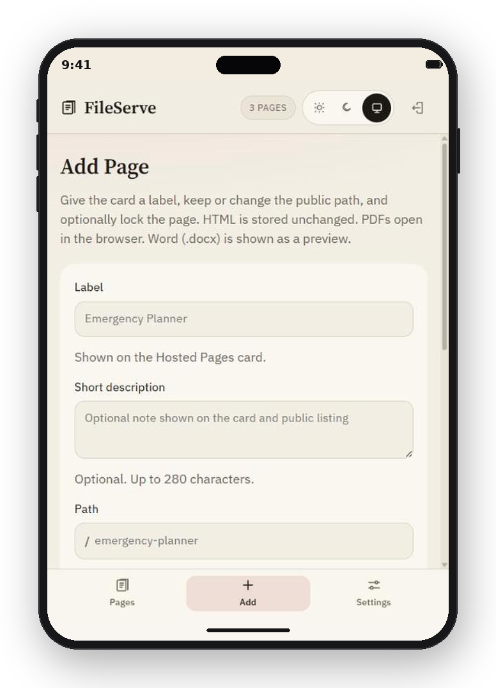
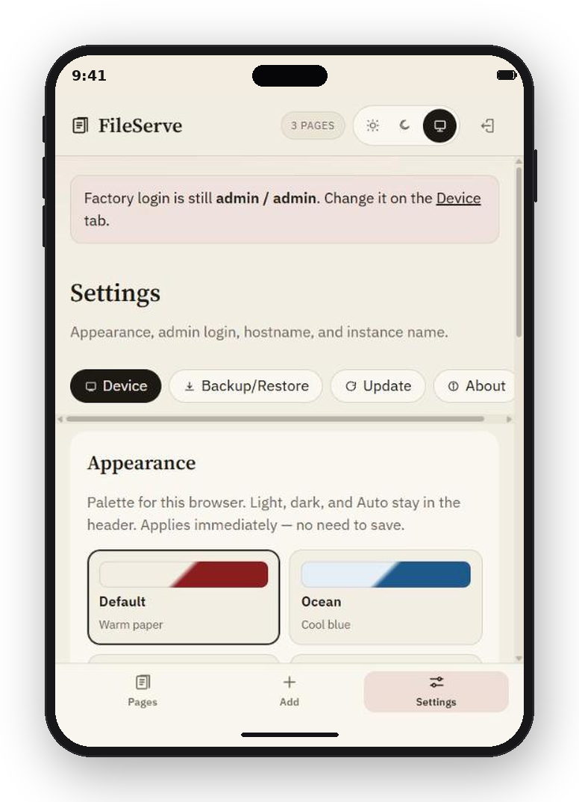

# FileServe

A small Flask host for household files. Upload HTML, PDF, or Word, get a friendly URL on your LAN, and manage everything from a user friendly admin UI.

Current version is **0.0.0.3**.

It runs the same way on Windows and Raspberry Pi OS. Hosted HTML is served as uploaded — no FileServe chrome, no rewriting. PDFs open in the browser. Word (`.docx`) is shown as a readable preview.

Default login: **admin** / **admin**. Change it on Settings after first launch.

<p align="center">
  
</p>

## What it does

- Hosts one HTML, PDF, or Word file per public path (`/emergency-planner`)
- Optional username and password per page; pages stay public unless you turn that on
- Optional expiry (1 week, 1 month, 3 months, 6 months, or a custom date); default is keep until removed
- Disable a page to hide the public URL without deleting its files
- Replace the hosted file later without changing the URL
- Lists, opens, edits, downloads, and deletes pages from an authenticated dashboard
- Card label, description, and path are set on Add and can be changed later; the path defaults from the label
- Public `/browse` listing of enabled, non-expired titles
- Light / Dark / Auto plus colour palettes (Default, Ocean, Forest, Slate)
- Backup and restore of the database, hosted files, and `.env`
- In-app GitHub Release check, install, and rollback

## Web UI

| Tab | What it is for |
| --- | --- |
| **Pages** | Hosted labels and paths, QR codes, search/sort, Enable/Disable, Open, Edit, copy/download/print actions, and Remove |
| **Add** | Label, optional description and path, optional page login, optional expiry, plus `.html`, `.pdf`, or `.docx` file |
| **Settings** | Device (appearance, admin login, hostname), Backup/Restore, Update, About |

<p align="center">
  
  
  
</p>

Public URLs such as `http://<pi-ip>:8081/emergency-planner` do not require a login unless you protect that page. Live titles are listed at `/browse`. FileServe defaults to port **8081**.

## Windows development

```powershell
python -m venv .venv
.\.venv\Scripts\Activate.ps1
pip install -r requirements.txt
copy .env.example .env
```

Double-click `run-local.bat` (or run `python run.py`). Open http://127.0.0.1:8081 and sign in with `admin` / `admin`.

Waitress serves the app on Windows. Gunicorn is used on the Pi.

## Raspberry Pi OS

Step-by-step: **[INSTALL.md](INSTALL.md)**.

On the PC, double-click `deploy\export-pi.bat`. It writes `dist\FileServe-pi`. Copy that onto the Pi, then:

```bash
cd /path/to/FileServe-pi
sudo ./deploy/install.sh --hostname fileserve
```

Open `http://fileserve.local:8081` (or `http://<pi-ip>:8081`), sign in with `admin` / `admin`, then change the password on Settings.

After you publish GitHub Releases, Settings can check and install that update in place. It backs up data first and does not overwrite `.env` or the `data` folder.

## Configuration

| Variable | Default | Notes |
| --- | --- | --- |
| `HOST` | `0.0.0.0` | Bind address so other devices on the LAN can connect |
| `PORT` | `8081` | HTTP port |
| `ADMIN_USERNAME` / `ADMIN_PASSWORD` | `admin` / `admin` | Factory login; Settings can change both |
| `GITHUB_REPO` | empty | `owner/FileServe` for in-app release checks |
| `DEVICE_HOSTNAME` | empty | Optional `.local` name on a Pi |
| `INSTANCE_NAME` | empty | Label for this copy (Home, Work) |

UI-saved Settings win over environment variables.
